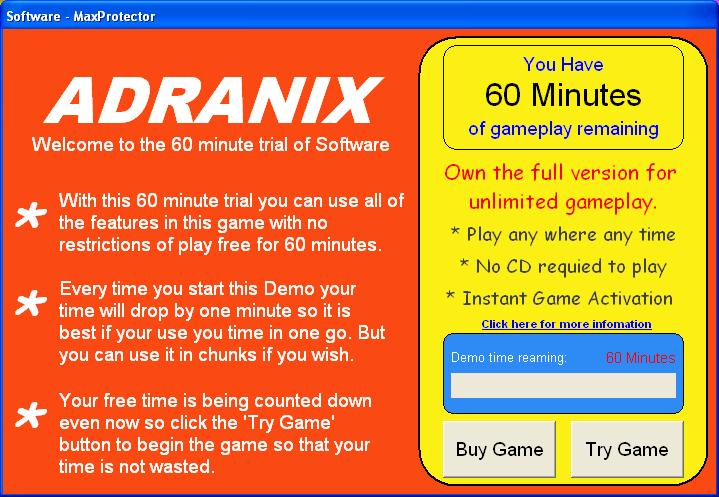



## Max Protector Registration Trial System \(Update\) \- See Screenshot\!

### Description

With MaxProtector you can give your users 60 minutes to try out your program (rather than 10 uses or 30 days) it includes many features along with a nice and bright layout/design, to register the software the user must have a unique registration code for their computer also if they enter the registration code in incorrectly they must also enter a PUK code to unblock it (which they must get off you) and then if they get it wrong a further 5 times after that the software will permanently disable its self (to unblock it after that you must go into the registry). MaxProtector will only allow one copy of its self to be open at any one time.

Main Features:

60 Minute Use Time Lock,

Unique Registration Codes,

PUK code Request,

Permanent Disable Feature,

Bright Design/Look,

Download link for KeyGen.

This as took ages to make and i am only 15 so please vote and PLEASE leave comments on what you think, thank you - also if anyone can make it so it encrypts the registry enterys it makes and then decrypts them to read them please let me know.

(WARNING - PLEASE ENSURE YOU ARE LOGGED ON AS AN ADMINISTRATOR BEFORE USING THIS SOFTWARE)
 
### More Info
 

             |
---                |---
**Submitted On**   |2006-08-05 18:50:58
**By**             |[Adam Ranshaw](https://github.com/Planet-Source-Code/PSCIndex/blob/master/ByAuthor/adam-ranshaw.md)
**Level**          |Intermediate
**User Rating**    |4.0 (16 globes from 4 users)
**Compatibility**  |VB 5\.0, VB 6\.0
**Category**       |[Registry](https://github.com/Planet-Source-Code/PSCIndex/blob/master/ByCategory/registry__1-36.md)
**World**          |[Visual Basic](https://github.com/Planet-Source-Code/PSCIndex/blob/master/ByWorld/visual-basic.md)
**Archive File**   |[Max\_Protec201149862006\.zip](https://github.com/Planet-Source-Code/adam-ranshaw-max-protector-registration-trial-system-update-see-screenshot__1-60814/archive/master.zip)

